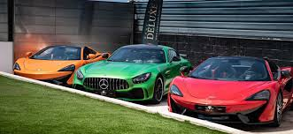

# TODO SOBRE COCHES

Los coches, también conocidos como automóviles, son vehículos motorizados diseñados para el transporte de personas y mercancías. Han sido una parte fundamental de la sociedad durante más de un siglo y han experimentado numerosas mejoras y avances a lo largo de su historia.

## Componentes de un coche

Los coches modernos generalmente se componen de los siguientes componentes principales:

- **Chasis:** Es la estructura que proporciona la base y soporte para todos los demás componentes del coche. Puede estar hecho de acero, aluminio o fibra de carbono, dependiendo del diseño y el rendimiento requerido.
- **Carrocería:** Es la cubierta externa del coche y le da su forma distintiva. Además de su función estética, la carrocería también contribuye a la aerodinámica y la seguridad del vehículo.
- **Motor:** Puede ser de combustión interna, eléctrico o híbrido. El motor de combustión interna, que puede funcionar con gasolina, diésel o gas, es el tipo más común. Los motores eléctricos utilizan energía almacenada en baterías recargables, mientras que los motores híbridos combinan un motor de combustión interna con uno o más motores eléctricos.
- **Sistema de transmisión:** Permite controlar la velocidad y el movimiento del coche. Puede ser manual, donde el conductor cambia de marcha manualmente, o automático, donde el cambio de marchas se realiza de forma automática por el sistema.
- **Suspensión:** Ayuda a absorber las irregularidades del terreno y proporciona una conducción más suave y cómoda. Los sistemas de suspensión pueden ser independientes en cada rueda o utilizar un eje rígido en la parte trasera.
- **Frenos:** Permiten detener el coche mediante la fricción entre las pastillas y los discos de freno. Los sistemas de frenos modernos suelen utilizar frenos de disco en las ruedas delanteras y traseras, aunque algunos coches más pequeños todavía utilizan frenos de tambor en la parte trasera.
- **Sistemas electrónicos:** Incluyen el sistema de encendido, el sistema de gestión del motor, el sistema de entretenimiento, la climatización y otros componentes electrónicos de control y comodidad. Estos sistemas están interconectados y utilizan sensores y actuadores para garantizar un rendimiento óptimo del coche.

## Historia de los coches

La historia de los coches se remonta al siglo XIX, cuando los primeros modelos de automóviles de vapor y eléctricos fueron desarrollados. Sin embargo, fue con la invención del motor de combustión interna que los coches realmente despegaron en popularidad. En 1886, Karl Benz patentó el primer automóvil propulsado por gasolina, sentando las bases de la industria automotriz.

A lo largo del siglo XX, los coches se convirtieron en símbolos de libertad y movilidad, y se hicieron accesibles para un público más amplio. La producción en masa, introducida por Henry Ford con el
